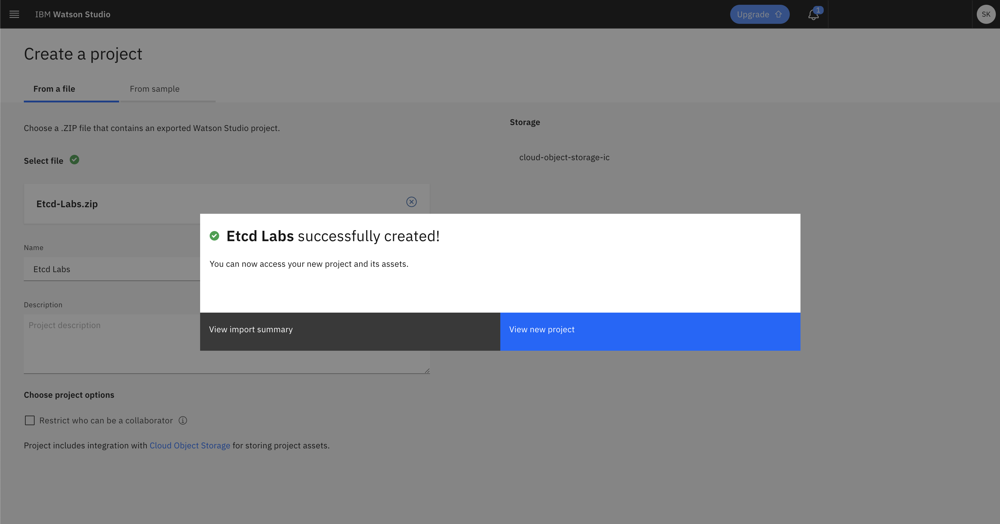
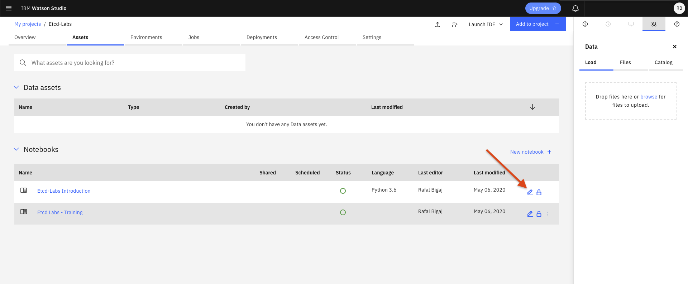

# Wprowadzenie do laboratorium z Etcd

Laboratorium z bazy danych Etcd będzie przeprowadzopne w środowiska Jupyter Notebooks w Watson Studio,
które wymaga rejestracji w IBM Cloud.
Dla studentów i pracowników naukowych oferujemy specjalne kody promocyjne, które pozwalają na pracę z większą ilością
serwisów w chmurze.

Procedura rejestracji:
https://ibm.box.com/shared/static/nw3ednr2c43gzaw4gj1yl1ak0jgv1qkg.pptx

Konto IBM Cloud umożliwia dostęp do Watson Studio, po zalogowaniu się pod adresem: 
https://dataplatform.cloud.ibm.com/home

## Tworzenie projektu w Watson Studio

Sciągnij z repozytorium git plik o nazwie: [Etcd-Labs.zip](./Etcd-Labs.zip) i zapisz na dysku lokalnym.

Na stronie głównej [Watson Studio](https://dataplatform.cloud.ibm.com/home) kliknij 'New project':

Następnie wybierz 'Create a project from a sample or file':

Aby móc stworzyć projekt potrzebujesz miejsce na twoje zasoby, kliknij 'Add' w sekcji '1. Select storage service':

Na kolejnym ekranie wybierz darmowy plan 'Lite':
 

i potwierdź wybór:

Po powrocie na ekran tworzenia projektu, wybierz ściągnięty plik: 'Etcd-Labs.zip'

nazwij projekt i wciśnij 'Create':

Przejdź do stworzonego projektu wybierając 'View new project':

W zakładce 'Assets' wybierz _notebook_ 'etcd_lab':

Gratulacje! Możesz przystąpić do realizacji zadań.